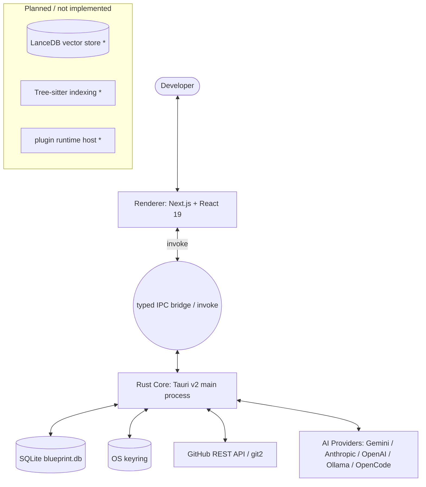
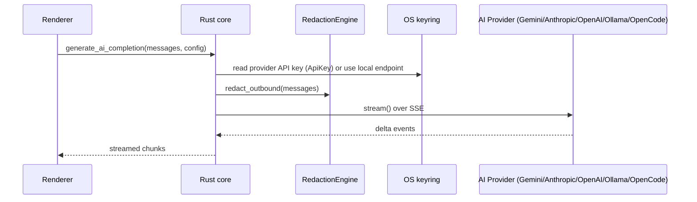

# Blueprint Architecture

> **Accuracy note (2026-07-31):** This document describes **what exists in the repository**, not what is aspirational. Where a subsystem is a stub or planned, it is explicitly marked. Discrepancies are tracked in `PROJECT_AUDIT.md`.

Blueprint is an **AI Engineering Operating System**: a local-first, Tauri v2 desktop application whose renderer (Next.js/React) talks to a Rust core over typed IPC. The AI model is a swappable provider; Blueprint owns orchestration, personas, workflows, memory, tools, and project intelligence.

---

## 1. System Overview



`*` — documented intent, not yet implemented. Vector memory is planned (memory is SQL-only today); the repo scanner is extension-based (no Tree-sitter); the plugin SDK exists but no runtime loads `plugins/*`.

## 2. Process Model (Tauri v2)

- **Main process (Rust):** filesystem, SQLite memory, GitHub/git2 client, AI provider dispatch with streaming, redaction, keyring access. This is the security boundary — only Rust touches secrets and storage.
- **Renderer (Next.js):** UI, workspace state (zustand), tab/wing management, command palette. Zero direct OS/Shell access.

> **Gap:** `shell:allow-open` is declared in `tauri.conf.json` but no Tauri v2 `capabilities/` file exists yet — permissions are not explicitly declared. Tracked as P0 in `PROJECT_AUDIT.md`.

## 3. Data Flow

### 3.1 AI completion (streaming)



`stream()` is the trait primitive; `complete()` is derived by buffering. Provider auth is provider-declared: `AuthKind::ApiKey` (hosted) or `AuthKind::LocalEndpoint` (Ollama/OpenCode). Typed `ProviderError` distinguishes auth, rate-limit, and unreachable-local-daemon.

### 3.2 Memory

- `MemoryManager` (Rust) owns a SQLite DB (`blueprint.db`) with tables `projects`, `adrs`, `memory_entries`, `user_preferences`.
- Commands: `get_adrs`, `search_memory` (SQL LIKE search — **no vector embeddings**).
- `packages/brain` is an empty stub; the documented "Project Brain / LanceDB" does not exist.

### 3.3 Git & GitHub

- `git/mod.rs` — real operations via `git2`: status, branch create, commit, state summary; `push_git_changes` shells out to `git` for credential-helper/SSH/2FA compatibility. GitHub REST via reqwest with keyring token.
- All commands the frontend invokes are implemented and cross-checked by `scripts/check-ipc-contract.mjs` (`pnpm check:ipc`): **18 invoked, 36 registered, 36 defined**.

## 4. Package Relationships

```mermaid
graph LR
    Desktop[apps/desktop blueprint-desktop]
    UI[@blueprint/ui]
    Adapters[@blueprint/ai-adapters]
    GitEngine[@blueprint/git-engine]
    Types[@blueprint/types]
    PSDK[@blueprint/plugin-sdk]
    Brain[@blueprint/brain *]
    Core[@blueprint/core *]
    Personas[packages/personas data]

    Desktop --> UI & Adapters & GitEngine & Types & PSDK & Brain & Core
    Adapters --> Types
    GitEngine --> Types
    PSDK --> Types
    Plugins[plugins/*] --> PSDK
    RustCore[Rust core] -. loads .-> Personas
```

- `apps/desktop` — the Tauri app (Next.js renderer + Rust core). Only workspace with runtime code.
- `apps/docs` — **empty directory**.
- `@blueprint/ui` — Ink & Mint design system (14 components; single token source after consolidation).
- `@blueprint/ai-adapters` — thin TS bridge to `generate_ai_completion`.
- `@blueprint/git-engine` — thin TS bridge to GitHub/git commands.
- `@blueprint/types` — shared TS types.
- `@blueprint/plugin-sdk` — types + abstract `BlueprintPlugin`. No runtime host yet.
- `@blueprint/brain`, `@blueprint/core` — **empty stubs**.
- `packages/personas` — persona data files (18 dirs); **not a pnpm package** (no `package.json`).
- `plugins/*` — 9 official plugins; 5 manifest-only, 4 minimal activations; **never loaded at runtime**.

## 5. Subsystems

| Subsystem | Location | Status |
|---|---|---|
| Desktop shell (layout, tabs, wings, command palette) | `apps/desktop/src/{components,store}/` | Working (renderer-side) |
| Design system | `packages/ui` | Working; single token source |
| AI provider abstraction | `apps/desktop/src-tauri/src/ai/providers/` | Gemini/Anthropic/OpenAI real (SSE); Ollama + OpenCode added; streaming primitive |
| Provider routing | `ai/manager.rs` `RoutingConfig` | User-owned, validated; Settings Routing tab |
| Redaction engine | `ai/redaction.rs` | Regex-based, centralized, 8 tests |
| AOS kernel | `ai/aos/` | Foundation; tool-calling loop not implemented (dead code) |
| Persona registry | `ai/aos/persona.rs` + `packages/personas` | Loads `persona.json`; incomplete data; instructions not read |
| Memory system | `memory/mod.rs` (SQLite) | SQL-only; no vectors |
| Project intelligence | `intelligence/` | Extension-based scanner; no Tree-sitter |
| Git / GitHub | `git/mod.rs` | git2 real ops; GitHub REST |
| Plugin SDK / runtime | `packages/plugin-sdk`, `plugins/manager.rs` | Types + manifest reader; no runtime host |
| IPC contract | `scripts/check-ipc-contract.mjs` | Enforces invoke/handler parity in CI |

## 6. Security Model

1. **Keyring:** provider API keys and GitHub tokens stored via Rust `keyring` crate; renderer never sees them.
2. **Redaction:** centralized `redact_outbound` scrubs secrets on every provider path; Gemini key sent as `x-goog-api-key` header (never a query param).
3. **IPC:** typed Tauri commands; parity enforced by `check-ipc-contract`; HTTP clients have timeouts; mutex guards recovered not `unwrap()`-ed.
4. **Gaps:** no Tauri v2 capabilities file (P0); SQLite DB/plugin dir resolved to app-data in dev but packaged-path behavior unproven; `PythonRunner` executes `python` subprocesses with no permission gate.

## 7. Data Flow Summary (end-to-end intent)

User intent → command palette → zustand workspace state → typed `invoke` → Rust command → (redaction) → provider/GitHub/SQLite → streamed response → renderer store → UI.

## 8. Related Docs

- `PROJECT_AUDIT.md` — honest subsystem-by-subsystem state and debt.
- `AGENTS.md` — engineering constitution and Definition of Done.
- `FERANMI-EDIT.md` — the 2026-07-31 audit & repair log (build, providers, IPC, CI).
- `docs/architecture/*` — detailed design docs (several describe planned systems; treat as design intent, not implementation truth).
