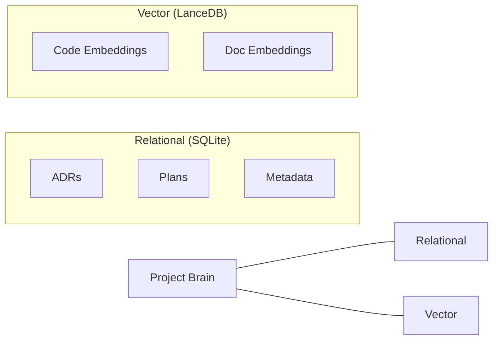
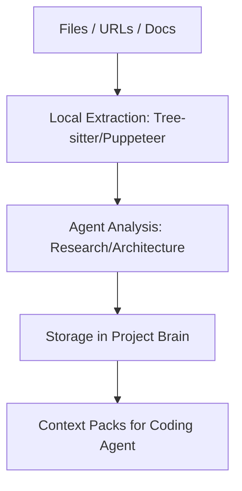

# Blueprint Engineering Architecture

Blueprint is a high-performance, local-first **AI Engineering Command Center**. It is designed to be the "Intelligence Layer" that coordinates tools and captures project memory.

---

## 🏗 Bicameral Process Model

We leverage **Tauri v2** to enforce a strict separation between UI and high-privilege operations:

1. **Main Process (Rust):**
   - **Responsibility:** Filesystem access, Indexing, Git, DB management.
   - **Security:** Hardware-backed secret storage (Keychain).
   - **Performance:** Multi-threaded indexing using Tree-sitter.

2. **Renderer Process (React/Next.js):**
   - **Responsibility:** UI, Interaction logic, Workspace state.
   - **Constraint:** Zero direct access to OS/Shell APIs.

---

## 🧠 The Project Brain

Blueprint uses a hybrid storage model to manage project intelligence:

### 1. Relational Memory (SQLite)

Tracks **Architecture Decision Records (ADRs)** and implementation history. This is the "Why" behind the code.

### 2. Semantic Memory (LanceDB)

A local, serverless vector database that allows for semantic search across codebases of 100k+ files.

---

## 🔄 Project Intelligence Pipeline

How Blueprint understands your project:

---

## 🔒 Security & Privacy

1. **Local Redaction:** Before any text is sent to an AI provider, it passes through a local engine that redacts secrets and PII.
2. **Scoping:** Blueprint is strictly scoped to the project root directory. It cannot traverse your entire disk.
3. **Provider Agnostic:** We use an Adapter Pattern so you can use any provider (Gemini, Claude, OpenAI) or local models (Ollama).

---

## 📖 Related Docs

- [Data Architecture & Memory](docs/architecture/DATA_ARCHITECTURE_AND_MEMORY_SYSTEM.md)
- [AI Intelligence Layer](docs/architecture/AI_INTELLIGENCE_ARCHITECTURE.md)
- [Security Model](docs/architecture/SECURITY_ARCHITECTURE.md)
