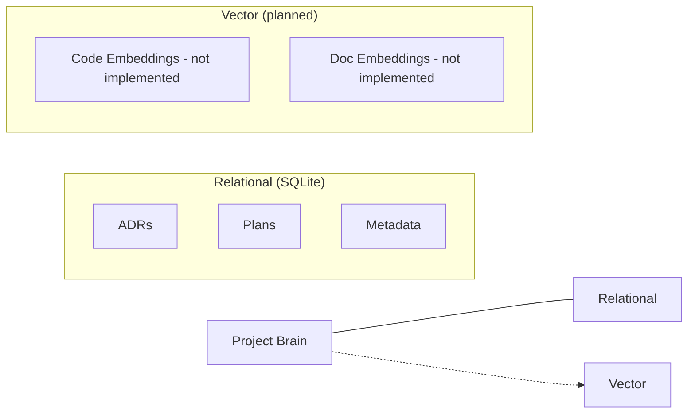
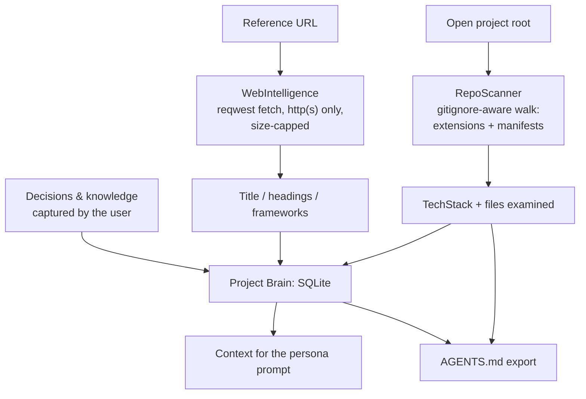
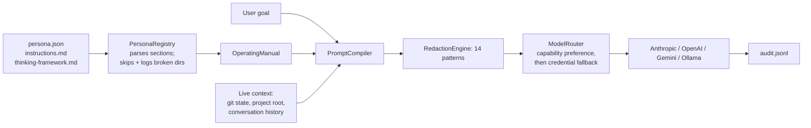

# Blueprint Engineering Architecture

Blueprint is a high-performance, local-first **AI Engineering Command Center**. It is designed to be the "Intelligence Layer" that coordinates tools and captures project memory.

---

## 🏗 Bicameral Process Model

We leverage **Tauri v2** to enforce a strict separation between UI and high-privilege operations:

1. **Main Process (Rust):**
   - **Responsibility:** Filesystem access, Indexing, Git, DB management.
   - **Security:** Hardware-backed secret storage (Keychain).
   - **Performance:** Repository scanning runs on a blocking task off the async
     runtime so the window never stalls. (Tree-sitter parsing is planned, not
     implemented — see ROADMAP.)

2. **Renderer Process (React/Next.js):**
   - **Responsibility:** UI, Interaction logic, Workspace state.
   - **Constraint:** Zero direct access to OS/Shell APIs.

---

## 🧠 The Project Brain

Blueprint uses a hybrid storage model to manage project intelligence:



### 1. Relational Memory (SQLite)

Tracks **Architecture Decision Records (ADRs)** and implementation history. This is the "Why" behind the code.

### 2. Semantic Memory (planned, not implemented)

The intended design is a local, serverless vector store (LanceDB) for semantic
search across large codebases. **This does not exist yet**: `search_memory` is a
SQL `LIKE` query over the relational store. It is shown here as design, and the
UI no longer advertises vector search.

---

## 🔄 Project Intelligence Pipeline

How Blueprint understands your project, as implemented:



Semantic (AST-level) extraction is **not** implemented; the scanner classifies by
file extension and manifest contents. See ROADMAP.

---

## 🤖 Agent OS: the persona pipeline

A persona is a directory of markdown and JSON in `packages/personas` — not a
prompt string in code. The registry resolves it from `$BLUEPRINT_PERSONAS_DIR`,
then the Tauri bundle resource, then the monorepo checkout.



From the manual, the compiler injects: identity and mission, capabilities as
expertise, parsed core responsibilities, the **verbatim operating manual**
(capped at 8 000 characters), the thinking framework with its step hierarchy, and
the parsed quality checklist and output format. `reload_personas` re-reads the
directory at runtime, so editing a manual needs no restart.

Contract and catalogue: [`packages/personas/README.md`](packages/personas/README.md).

---

## 🔁 Agent interoperability

Blueprint's memory is only useful if the other agents a developer runs can see
it. `interop::export_agent_context` renders one canonical file and two pointers
into the open project root:

```text
AGENTS.md     full context: repo facts, detected stack, declared commands,
              ADRs, sealed knowledge, persona standards,
              Always / Ask-first / Never boundaries   (OpenCode, Codex CLI, Amp,
                                                       Jules, Cursor, Zed)
CLAUDE.md     pointer: instruction + "@AGENTS.md"     (Claude Code)
GEMINI.md     pointer: instruction + "@AGENTS.md"     (Gemini CLI)
knowledge.md  pointer: instruction + "@AGENTS.md"     (Freebuff / Codebuff, which
                                                       read knowledge.md first)
```

Invariants: files carrying Blueprint's generation marker are overwritten, files
that do not are **never** touched (they are reported as skipped); every value
passes the redactor before it is written; output is bounded (40 ADRs, 60
memories, 20 commands, 1 200 characters per field); each export appends an audit
event. The commands section is populated only from declarations found on disk
(`package.json` scripts, `make` targets), never guessed.
Rationale and alternatives: [ADR 0003](docs/adr/0003-agent-interop-through-agents-md.md).

---

## 🔒 Security & Privacy

1. **Local Redaction:** Before any text is sent to an AI provider — and before
   anything is written into an exported `AGENTS.md` — it passes through a local
   engine matching 14 secret patterns. The count of redacted spans is measured
   and surfaced, never assumed.
2. **Scoping:** Blueprint operates on the project root you opened through the
   native directory picker. The renderer holds no filesystem or shell
   permission; every privileged operation runs in the Rust core.
3. **Credential store:** API keys and the GitHub token live in the OS credential
   store (Windows Credential Manager, macOS Keychain, freedesktop Secret
   Service), never in a config file or the database.
4. **Provider Agnostic:** An adapter pattern lets you use Gemini, Claude or
   OpenAI, or a local Ollama server — which needs no key and keeps source on the
   machine.
5. **Auditable:** Security-relevant events append to `audit.jsonl` in the
   per-user log directory: credential writes, AI calls (provider, model,
   redactions, route substitutions), repository scans, ADR creation and
   agent-context exports.

---

## 📖 Related Docs

- [Data Architecture & Memory](docs/architecture/DATA_ARCHITECTURE_AND_MEMORY_SYSTEM.md)
- [AI Intelligence Layer](docs/architecture/AI_INTELLIGENCE_ARCHITECTURE.md)
- [Security Model](docs/architecture/SECURITY_ARCHITECTURE.md)
