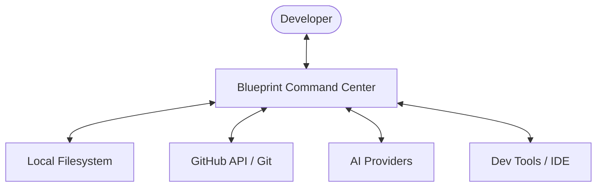
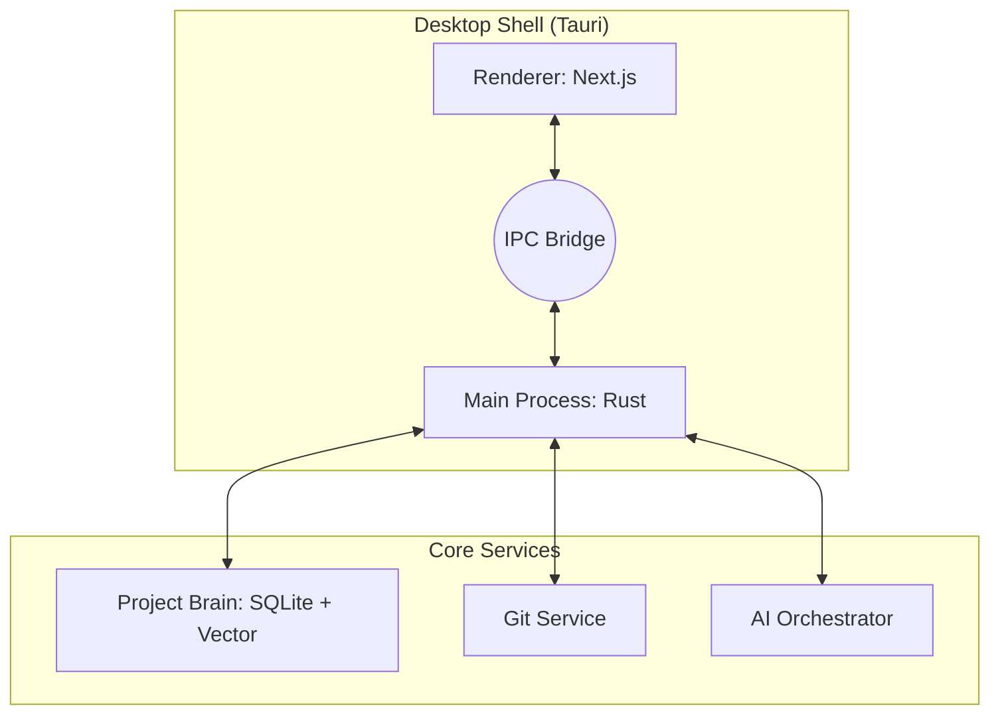
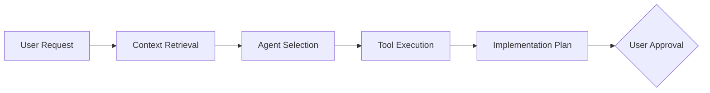

# Blueprint: AI Engineering Command Center

[](#)
[](#)
[](LICENSE)

**Blueprint** is a professional engineering workspace that sits above your development workflow. It unifies project intelligence, architectural memory, and AI orchestration into a single high-performance command center.

---

## 🔴 The Problem
Modern development is fragmented. Planning lives in Notion, design in Figma, code in VS Code, and context disappears in separate AI chats. This leads to **context loss**, **architectural drift**, and **technical debt**.

## 🟢 The Solution
Blueprint acts as the **Engineering Brain** of your project. It captures the *intent* behind the code, maintains project memory across sessions, and ensures that AI assistance is always grounded in your specific architectural rules.

---

## 🚀 Core Features

### 🧠 Project Intelligence
Deep semantic analysis of your entire repository using Tree-sitter. Blueprint understands your codebase's structure, patterns, and dependencies.

### 🏛 Architectural Memory
Maintain **Architecture Decision Records (ADRs)** directly linked to your code. The AI knows *why* you chose PostgreSQL or React.

### 🔍 Reference Intelligence
Ingest websites, documentation, and screenshots. Blueprint extracts technical patterns and design tokens to accelerate your implementation.

### 🛡 Security First
Local-first indexing. Your source code never leaves your machine unless you explicitly request an AI plan, and even then, secrets are redacted locally.

---

## 🏗 System Architecture

### High-Level Overview


### Desktop Application Internal Flow


### AI Intelligence Pipeline


---

## 📦 Project Structure

```text
/
├── apps/
│   └── desktop/        # Tauri + Next.js Desktop App
├── packages/
│   ├── ui/             # "Ink & Mint" Design System
│   ├── ai-adapters/    # Multi-provider AI Layer
│   ├── git-engine/     # Rust-bound Git Services
│   └── brain/          # Memory & Vector Indexing
├── docs/               # Detailed Documentation
└── tests/              # E2E & Integration Tests
```

---

## 🛠 Getting Started

### Prerequisites
- **Node.js** v20+ & **pnpm** v9+
- **Rust** (latest stable)
- **Tauri dependencies** (OS specific)

### Installation
```bash
pnpm install
```

### Development
```bash
pnpm dev
```

## 🌳 Development Workflow

Blueprint follows a professional engineering workflow to maintain high code quality and clear institutional memory.

### Branching Strategy
- **`main`**: Production-ready code.
- **`develop`**: Integration branch for all features.
- **`feature/*`**: Scoped feature development (e.g., `feature/ai-memory`).
- **`fix/*`**: Bug fixes.
- **`refactor/*`**: Code improvements.

### Commit Conventions
We use **Conventional Commits** to generate automated changelogs:
- `feat(scope):` ...
- `fix(scope):` ...
- `docs(scope):` ...
- `refactor(scope):` ...
- `chore(scope):` ...

### Pull Request Process
1. Create a feature branch from `develop`.
2. Commit changes following the standard.
3. Open a PR against `develop`.
4. PR must pass all CI checks (Lint, Typecheck, Test, Build).
5. Requires at least one maintainer approval.

---

## 📖 Documentation
- [Architecture Deep Dive](docs/architecture/SYSTEM_ARCHITECTURE.md)
- [Design System](docs/architecture/DESIGN_SYSTEM.md)
- [Implementation Roadmap](docs/product/PRODUCT_DISCOVERY.md)
- [Contributing Guide](docs/guides/CONTRIBUTING_GUIDE.md)

## ⚖️ License
Licensed under the [MIT License](LICENSE).
