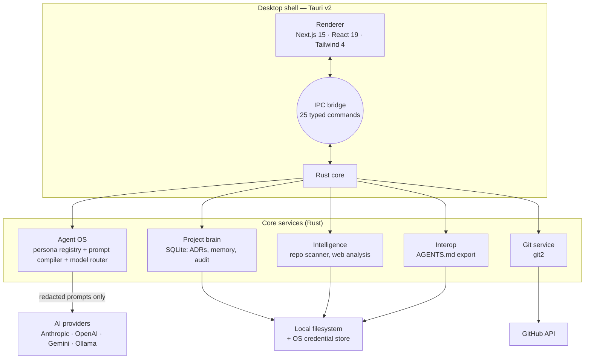

<div align="center">

# Blueprint

**Engineering memory for software projects — a local-first desktop app that
remembers why your code is the way it is, and makes every AI teammate inherit
that understanding.**

[](https://github.com/Emerald-dev0/Blueprint/actions/workflows/ci.yml)
[](https://github.com/Emerald-dev0/Blueprint/actions/workflows/desktop.yml)


Windows · Linux (deb / rpm / AppImage) · macOS — Tauri v2 + Next.js 15 + Rust

</div>

---

## Contents

- [What Blueprint is](#what-blueprint-is)
- [What it is not](#what-it-is-not)
- [Feature status](#feature-status)
- [Personas](#personas)
- [Agent interoperability](#-agent-interoperability)
- [A tour of the app](#a-tour-of-the-app)
- [Architecture](#architecture)
- [Repository layout](#repository-layout)
- [Quickstart](#quickstart)
- [Configuration](#configuration)
- [Packaging and releases](#packaging-and-releases)
- [Testing and CI](#testing-and-ci)
- [Security and privacy](#security-and-privacy)
- [Limitations and roadmap](#limitations-and-roadmap)
- [Contributing](#contributing)
- [License](#license)

---

## What Blueprint is

Coding assistants are excellent at writing code and terrible at remembering
anything. Every session starts from zero: nobody recalls that you chose
PostgreSQL over MongoDB for a reason, that the auth flow was redesigned after an
incident, or that the team agreed never to add a second state manager. That
amnesia is why AI-assisted projects drift — the model keeps proposing things you
already rejected.

Blueprint is the memory layer that sits beside your editor. It does four things:

1. **It reads your repository locally.** A `.gitignore`-aware walk reports the
   languages, frameworks and data stores in use and how many files were
   examined. Nothing is uploaded to do it.
2. **It stores your decisions.** Architecture Decision Records (context,
   decision, consequences) and sealed knowledge entries live in a local SQLite
   database and are searchable.
3. **It runs AI through persona operating manuals.** Instead of "you are a
   helpful assistant", Blueprint compiles a 24-strong registry of engineering
   playbooks — Principal Engineer, Security Engineer, SRE, Data Engineer — into
   the system prompt, together with your git state and project context.
4. **It exports that understanding to every other agent you use.** One command
   writes `AGENTS.md` (plus `CLAUDE.md` and `GEMINI.md` pointers) into your
   project, so OpenCode, Codex CLI, Claude Code and Gemini CLI all start from
   your decisions instead of guessing.

The product premise in one sentence: **architectural memory is the missing
primitive in AI-assisted development, and it belongs on your machine.**

## What it is not

Honesty about scope is part of the engineering standard here, so:

- **Not an editor and not an IDE replacement.** It does not open files, edit
  code, or run your tests. It is a command centre beside your tools.
- **Not a cloud service.** There is no account, no sync, no server. The database
  is a file in your per-user application data directory.
- **Not a semantic code search engine.** Retrieval is SQLite `LIKE` matching.
  Vector indexing is on the roadmap and is not claimed anywhere until it exists.
- **Not finished.** Version `0.1.0`. The installers CI produces are **unsigned**.

See [Limitations and roadmap](#limitations-and-roadmap) for the full list, and
[`docs/product/STRATEGIC_ASSESSMENT.md`](docs/product/STRATEGIC_ASSESSMENT.md)
for the unvarnished product critique that guides what gets built next.

## Feature status

| Area | Capability | Status |
| --- | --- | --- |
| Project intelligence | Local repository scan (languages, frameworks, data stores, file count) | ✅ Implemented |
| Project intelligence | Website reference analysis (title, headings, framework detection) | ✅ Implemented |
| Project intelligence | Tree-sitter semantic parsing / AST analysis | ❌ Not started |
| Project intelligence | Architecture graph rendering | ❌ Not started |
| Memory | ADR create / list / search, persisted to SQLite | ✅ Implemented |
| Memory | Tiered knowledge entries (session, project, decision, knowledge, user, agent) | ✅ Implemented |
| Memory | Append-only local audit log (`audit.jsonl`) | ✅ Implemented |
| Memory | Vector / semantic retrieval | ❌ Not started (SQL `LIKE` only) |
| Agent OS | Persona registry loaded from disk with hot reload | ✅ Implemented (24 personas) |
| Agent OS | Prompt compiler: manual + framework + quality gates + live context | ✅ Implemented |
| Agent OS | Secret redaction on every outbound message, measured | ✅ Implemented |
| Agent OS | Model routing across Anthropic / OpenAI / Gemini / local Ollama, with credential-aware fallback | ✅ Implemented |
| Agent OS | Workflow planning, surfaced in Agent OS → Workflow Planner | ⚠️ Fixed three-task scaffold (requirements → architecture → review); no LLM decomposition |
| Git | Status, ahead/behind, changed files, recent commits, branch creation, commit-message drafting, release notes | ✅ Implemented in the core; status, commits and release notes are surfaced on `/github` |
| Git | Pull requests, issues, review automation | ❌ Not started |
| Git | Commits and pushes from inside the app | ❌ Not started |
| Interop | `AGENTS.md` / `CLAUDE.md` / `GEMINI.md` export | ✅ Implemented |
| Workspace | Read-only file tree of the open project (explorer panel, inspector, project home) | ✅ Implemented (capped at 2000 entries / 6 levels, and it says so) |
| Credentials | GitHub personal access token in the OS credential store, with a check that it works | ✅ Implemented |
| Plugins | Manifest discovery and listing | ⚠️ Loads manifests; no runtime execution surface |
| Desktop | Windows / Linux / macOS bundles built in CI | ✅ Implemented (unsigned); verified on a pull request with the `build:bundles` label |

## Personas

24 engineering playbooks, each a directory of markdown and JSON in
[`packages/personas`](packages/personas):

```text
accessibility-engineer      database-engineer         mobile-engineer          software-architect
api-designer                devops-engineer           performance-engineer     system-designer
backend-engineer            documentation-specialist  platform-engineer        technical-writer
data-engineer               engineering-manager       principal-engineer       ui-designer
frontend-engineer           machine-learning-engineer product-manager          ux-designer
                            qa-engineer               reference-analyst
                            security-engineer         site-reliability-engineer
```

Each persona ships `persona.json` (identity, mission, capabilities, labels),
`instructions.md` (an operating manual with responsibilities, decision
framework, failure modes, output standards and a quality checklist) and
`thinking-framework.md` (numbered reasoning steps with their probing questions).
The Rust loader parses those sections into the compiled system prompt — a
persona is a behaviour contract, not a role label.

- Browse the loaded registry at **Agent OS** (`/ai/aos`), reload it after
  editing a manual without restarting the app.
- Pick one at **AI Teammate** (`/ai`) to send your goal through it.
- Add your own: see [Adding a persona](packages/personas#adding-a-persona).
  `tests/unit/personas.test.ts` enforces the structure for every directory.

## 🔁 Agent interoperability

Blueprint is not the only agent in a developer's day. **Intelligence → Export
agent context** writes the shared convention those tools already read:

| File | Contents | Read by |
| --- | --- | --- |
| `AGENTS.md` | Full generated context: repository facts, detected stack, declared build/test commands, recorded ADRs, sealed knowledge, persona standards, and Always / Ask-first / Never boundaries | [OpenCode](https://opencode.ai/docs/rules/), Codex CLI, Amp, Jules, Cursor, Zed, Factory |
| `CLAUDE.md` | Pointer to `AGENTS.md` (plain instruction + `@AGENTS.md` import) | Claude Code, OpenCode fallback |
| `GEMINI.md` | Pointer to `AGENTS.md` | Gemini CLI |
| `knowledge.md` | Pointer to `AGENTS.md` | [Freebuff](https://freebuff.com) and Codebuff, which resolve `knowledge.md` → `AGENTS.md` → `CLAUDE.md` |

The commands section lists only what is actually declared in the repository
(`package.json` scripts with the right package manager, `make` targets) — an
agent that invents `npm test` in a pnpm monorepo is the most common way these
files fail.

Filename precedence differs per tool, so Blueprint writes a pointer under each
name a tool looks for first: Freebuff and Codebuff resolve `knowledge.md` before
`AGENTS.md`, and OpenCode prefers `AGENTS.md` and falls back to `CLAUDE.md`. A
pointer carries both an explicit instruction to read `AGENTS.md` and an
`@AGENTS.md` import, so it works whether or not the tool parses imports.

Two guarantees: values pass through the local secret redactor before they touch
disk (and the count is reported), and a file Blueprint did not generate is
**never overwritten** — it is reported as skipped instead. The rationale and the
alternatives considered are recorded in
[ADR 0003](docs/adr/0003-agent-interop-through-agents-md.md).

## A tour of the app

| Route | What it does |
| --- | --- |
| `/` | Project home: open a repository through the native directory picker, then see its branch, divergence, changed files, recent commits and file counts |
| `/intelligence` | Repository scan, website reference analysis, agent-context export |
| `/ai` | AI Teammate chat: pick a persona, converse, see the model and redaction count per run |
| `/ai/aos` | Agent OS kernel: the loaded persona registry, manual by manual, plus the workflow planner |
| `/memory` | ADRs and knowledge entries: create, search, inspect |
| `/github` | Local git state (branch, ahead/behind, changed files, recent commits), release notes drafted from real history, your GitHub repositories with a working filter, and a scan of the open project |
| `/settings` | Provider API keys and the GitHub token (both in the OS credential store), plus installed plugin manifests |
| `/design-system` | The "Ink & Mint" component library, live |

Around those routes sits the shell: a file explorer that walks the project you
opened (`list_project_files` - read-only, skipping `.git`, dependencies and build
output), an inspector for whatever the explorer has selected, and a `Cmd/Ctrl+K`
palette whose entries all navigate somewhere real or act on the open project.

## Architecture



**Trust boundary.** The renderer has no filesystem or shell permission — the
Tauri v2 capability file grants `core:default` and the dialog plugin only. Every
privileged operation happens in the Rust main process, which validates its
inputs rather than trusting the WebView.

**Prompt pipeline.** Persona files → `PromptCompiler` (identity, mission,
responsibilities, verbatim operating manual, thinking framework, quality gates,
live git/project context, conversation history) → `RedactionEngine` (14 secret
patterns) → model router (capability preference, then credential-aware
fallback) → provider. Every step is recorded in the append-only audit log.

**Data.** One SQLite file plus one JSONL audit log, both in the per-user
application data directory resolved by Tauri (`%APPDATA%` on Windows, XDG data
dir on Linux, `~/Library/Application Support` on macOS) — never in the working
directory the app happened to be launched from.

More detail: [`ARCHITECTURE.md`](ARCHITECTURE.md),
[`docs/architecture/SYSTEM_ARCHITECTURE.md`](docs/architecture/SYSTEM_ARCHITECTURE.md),
[`docs/architecture/SECURITY_ARCHITECTURE.md`](docs/architecture/SECURITY_ARCHITECTURE.md).

## Repository layout

```text
.
├── apps/
│   └── desktop/
│       ├── src/                  # Next.js App Router renderer (static export)
│       │   ├── app/              # one directory per route
│       │   └── lib/              # ipc.ts (typed command surface), platform, routes
│       └── src-tauri/            # Rust core
│           ├── src/ai/           # providers, redaction, Agent OS (personas, compiler, router)
│           ├── src/memory/       # SQLite project brain
│           ├── src/intelligence/ # repo scanner, web analysis
│           ├── src/git/          # git2 commands
│           ├── src/interop.rs    # AGENTS.md / CLAUDE.md / GEMINI.md export
│           ├── src/project_files.rs # capped, read-only file tree for the explorer
│           ├── src/paths.rs      # per-user directory resolution
│           ├── capabilities/     # Tauri v2 ACL
│           └── icons/            # branded .png / .ico / .icns set
├── packages/
│   ├── ui/                       # "Ink & Mint" design system (React 19)
│   ├── personas/                 # 24 persona operating manuals (bundle resource)
│   ├── types/                    # shared TypeScript contracts
│   ├── git-engine/               # git + GitHub command surface, under contract test
│   ├── core/ · brain/ · ai-adapters/ · plugin-sdk/
├── plugins/                      # first-party plugin manifests
├── docs/                         # architecture, guides, product, ADRs
├── tests/unit/                   # Vitest suites (+ tests/stubs for the Tauri IPC stub)
└── .github/workflows/            # ci.yml · security.yml · desktop.yml
```

## Quickstart

### Prerequisites

| Requirement | Version | Notes |
| --- | --- | --- |
| Node.js | 22+ | developed and CI-tested on 22 |
| pnpm | 11 | `corepack enable pnpm` |
| Rust | stable | via [rustup](https://rustup.rs) |

Platform packages for the WebView:

```bash
# Debian / Ubuntu
sudo apt update && sudo apt install libwebkit2gtk-4.1-dev libgtk-3-dev \
  libayatana-appindicator3-dev librsvg2-dev libssl-dev pkg-config build-essential file

# Fedora / RHEL
sudo dnf install webkit2gtk4.1-devel gtk3-devel libappindicator-gtk3-devel \
  librsvg2-devel openssl-devel pkg-config gcc-c++

# Arch
sudo pacman -S webkit2gtk-4.1 gtk3 libayatana-appindicator librsvg openssl base-devel
```

Windows: [Microsoft C++ Build Tools](https://visualstudio.microsoft.com/visual-cpp-build-tools/)
plus WebView2 (preinstalled on Windows 11 and recent Windows 10). macOS: Xcode
command line tools (`xcode-select --install`).

### Run it

```bash
git clone https://github.com/Emerald-dev0/Blueprint.git
cd Blueprint
pnpm install

pnpm dev                                          # renderer only → http://localhost:3000
pnpm --filter blueprint-desktop tauri:dev         # full desktop app (compiles Rust)
```

`pnpm dev` in a plain browser renders the UI, but every `invoke()` rejects —
there is no Rust core. Use `tauri:dev` for real behaviour.

> **First Rust build:** `next build` must have produced `apps/desktop/out`
> before `cargo` compiles the Tauri binary, because `generate_context!()`
> verifies `frontendDist` at compile time. `pnpm --filter blueprint-desktop
> tauri:dev` runs the `beforeDevCommand` for you; a bare `cargo build` in
> `src-tauri/` needs `pnpm --filter blueprint-desktop build` first.

### Use it

1. **Open a project** — Projects → import a directory (native picker).
2. **Scan it** — Intelligence → repository mapping; note the detected stack.
3. **Add a key** — Settings → AI Providers (Anthropic, OpenAI or Gemini), or
   start a local Ollama server for fully offline use.
4. **Record a decision** — Memory → New ADR. This is what makes the rest worth
   using.
5. **Talk to a persona** — AI Teammate → pick Principal Engineer → ask it to
   review something.
6. **Export** — Intelligence → Export agent context, then open `AGENTS.md` in
   your repository and watch your other agents inherit the context.

Full walkthrough: [`docs/guides/GETTING_STARTED.md`](docs/guides/GETTING_STARTED.md).

## Configuration

**Credentials** are stored in the OS credential store, never in a config file:

| Secret | Store | Entry |
| --- | --- | --- |
| Provider API keys | Windows Credential Manager / macOS Keychain / freedesktop Secret Service | service `blueprint-ai`, one entry per provider id |
| GitHub token | same | service `blueprint-vcs`, entry `github` |

On Linux a Secret Service provider (`gnome-keyring`, KeePassXC, KWallet-compat)
must be running; headless containers have none and saving a key reports a clear
error instead of failing silently.

**Environment variables**

| Variable | Default | Purpose |
| --- | --- | --- |
| `BLUEPRINT_PERSONAS_DIR` | bundled resources, then `packages/personas` | override the persona registry location (development, CI) |
| `OLLAMA_HOST` | `http://127.0.0.1:11434` | local Ollama server for offline inference |
| `RUST_LOG` | `info` | Rust core log level (`debug` shows persona loading and route substitutions) |

**Model routing.** Reasoning and architecture tasks prefer Anthropic
(`claude-3-5-sonnet-latest`), coding and function calling prefer OpenAI
(`gpt-4o`), large-context and multimodal prefer Gemini (`gemini-1.5-pro`), and
offline/private work goes to Ollama (`llama3`). If the preferred provider has no
stored credential, Blueprint falls back to one that does — and records the
substitution in the audit log and the session panel rather than failing.

## Packaging and releases

`.github/workflows/desktop.yml` builds installers on three runners for every push
to `main` or `develop`. On a pull request it runs only when the `build:bundles`
label is applied, so the three-OS matrix can be proven before a merge without
paying for a cold Rust compile on three platforms for every push; remove and
re-add the label to run it again.

| Platform | Artefacts | Notes |
| --- | --- | --- |
| Windows 10/11 | NSIS `.exe`, `.msi` | per-user install, LZMA compression, WebView2 bootstrapped silently |
| Linux (glibc) | `.deb`, `.rpm`, `.AppImage` | built on Ubuntu 22.04 for the widest glibc compatibility; recommends `gnome-keyring` |
| macOS 12+ | `.app`, `.dmg` | built on `macos-latest` (arm64); no x86_64 or universal binary yet |

Persona files ship as a Tauri bundle resource (`packages/personas/` →
`personas/`), so an installed app resolves its registry from the bundle, not
from a checkout.

> **Installers are unsigned.** Windows SmartScreen and macOS Gatekeeper will
> warn. Code signing and notarization are roadmap items; see
> [ADR 0002](docs/adr/0002-cross-platform-packaging-and-truthful-surface.md).

Build locally with `pnpm --filter blueprint-desktop tauri:build`; artefacts land
in `apps/desktop/src-tauri/target/release/bundle/`.

## Testing and CI

```bash
pnpm lint          # ESLint across every workspace + next lint
pnpm typecheck     # tsc --noEmit across every workspace
pnpm test          # Vitest: 141 tests (persona registry contract, platform/route helpers,
                   # git-engine command contract, file-tree helpers)
pnpm build         # Next.js static export consumed by Tauri
```

`ci.yml` runs those plus a Rust job (`cargo fmt --check`, `cargo clippy
-- -D warnings`, `cargo test` — 27 tests covering redaction, the repo scanner,
prompt compilation, persona parsing, the file-tree walk's bounds and the date
maths behind the export). `security.yml` runs dependency and secret scanning;
`desktop.yml` builds the installers.

Two suites exist purely to stop the UI claiming things the core cannot do, which
is how the fabricated surfaces in earlier revisions survived:

- `tests/unit/git-engine.test.ts` reads `main.rs` and fails if the SDK invokes a
  command that is not in `generate_handler!` — the check that would have caught
  four methods whose commands never existed.
- The route-table tests in `tests/unit/platform.test.ts` fail if navigation
  offers a route with no `page.tsx`, or if a page exists that no route declares.

Tauri's IPC is aliased to `tests/stubs/tauri-core.ts` in `vitest.config.ts`: the
real module needs `window.__TAURI_INTERNALS__`, and pnpm's strict layout means
`vi.mock` cannot intercept the copy a package under test loads.

Rust tests need the frontend export to exist first:

```bash
pnpm --filter blueprint-desktop build
cd apps/desktop/src-tauri && cargo test
```

## Security and privacy

- **Local-first.** Repository scanning, the SQLite brain, the audit log and the
  `AGENTS.md` export are all local. Source code leaves the machine only inside a
  prompt you explicitly triggered.
- **Redaction before egress.** Every message of every role on every provider
  path passes through 14 secret patterns (PEM blocks, AWS, Anthropic, OpenAI,
  GitHub, Stripe, Slack, Google, JWT, bearer headers, connection strings,
  generic key/secret assignments). The count is measured and shown, not assumed.
  The same redactor runs over exported agent-context files before they are
  written to disk.
- **Least privilege IPC.** The renderer gets `core:default` and the dialog
  plugin. No filesystem, no shell, no arbitrary command execution — an earlier
  `run_python_tool` command that allowed exactly that was removed.
- **Strict CSP.** No `unsafe-eval`; `connect-src` does not list provider origins
  because only the Rust core talks to them.
- **Auditable.** Security-relevant events append to `audit.jsonl` in the
  per-user log directory: app start, credential writes, AI calls with provider,
  model and redaction count, ADR creation, repository scans, agent-context
  exports.
- **No clobbering.** The exporter only overwrites files carrying its own
  generation marker.

Details: [`docs/architecture/SECURITY_ARCHITECTURE.md`](docs/architecture/SECURITY_ARCHITECTURE.md).

## Limitations and roadmap

Known gaps, stated plainly:

- Workflow planning returns a fixed three-task scaffold
  (`product-manager` → `software-architect` → `principal-engineer`) and only the
  first task quotes your goal; it is not LLM-decomposed yet. The planner panel
  says so rather than implying the goal was analysed.
- Memory search is SQL `LIKE`; there is no embedding index, so recall on
  paraphrased queries is poor.
- The plugin system loads and lists manifests but does not execute plugin code.
- No architecture graph: the Intelligence page shows the placeholder until a
  real dependency graph exists.
- The GitHub surface reads local git state and drafts release notes; it does not
  create pull requests or issues, and it does not commit or push. Nothing in the
  SDK advertises those operations, so there is no method to call by mistake.
- Repository links are copied, not opened: launching a browser from a Tauri
  webview needs `tauri-plugin-opener`, which is not a dependency. A link button
  that silently did nothing was worse than a copy button that reports success.
- The explorer's tree is capped (2000 entries, 6 levels) and skips dependency,
  build and cache directories; it reports when the cap was hit.
- Installers are unsigned; no auto-update channel.
- Single project at a time: the memory layer keys everything to one workspace id.

Planned next, in order: plan generation that uses the personas for real,
semantic retrieval, PR/issue integration, then plugin execution. Tracked in
[`ROADMAP.md`](ROADMAP.md); the strategic reasoning behind that order is in
[`docs/product/STRATEGIC_ASSESSMENT.md`](docs/product/STRATEGIC_ASSESSMENT.md).

## Contributing

1. Branch from `main` (`feature/*`, `fix/*`, `refactor/*`).
2. Follow [Conventional Commits](https://www.conventionalcommits.org/) —
   commitlint runs on every commit via husky.
3. Keep claims and code in step: if a feature does not exist, the docs must not
   say it does. This is enforced socially and by ADR 0002.
4. `pnpm lint && pnpm typecheck && pnpm test && pnpm build` must pass, plus
   `cargo clippy -- -D warnings` and `cargo test` for Rust changes.
5. Open a PR describing what changed, what it costs and what is still missing.

Read [`docs/guides/CONTRIBUTING_GUIDE.md`](docs/guides/CONTRIBUTING_GUIDE.md)
and the ADRs in [`docs/adr/`](docs/adr) before proposing a structural change.

## Documentation

| Document | Contents |
| --- | --- |
| [`ARCHITECTURE.md`](ARCHITECTURE.md) | System overview and module responsibilities |
| [`ROADMAP.md`](ROADMAP.md) | Phase plan with honest completion marks |
| [`CHANGELOG.md`](CHANGELOG.md) | Keep-a-Changelog entries per release |
| [`docs/guides/GETTING_STARTED.md`](docs/guides/GETTING_STARTED.md) | Per-OS setup, development, packaging |
| [`docs/guides/CONTRIBUTING_GUIDE.md`](docs/guides/CONTRIBUTING_GUIDE.md) | Workflow, conventions, review |
| [`docs/adr/`](docs/adr) | Architecture decision records |
| [`docs/product/STRATEGIC_ASSESSMENT.md`](docs/product/STRATEGIC_ASSESSMENT.md) | Product critique and wedge strategy |
| [`packages/personas/README.md`](packages/personas/README.md) | Persona file contract and catalogue |

## License

MIT — see [`LICENSE`](LICENSE).
