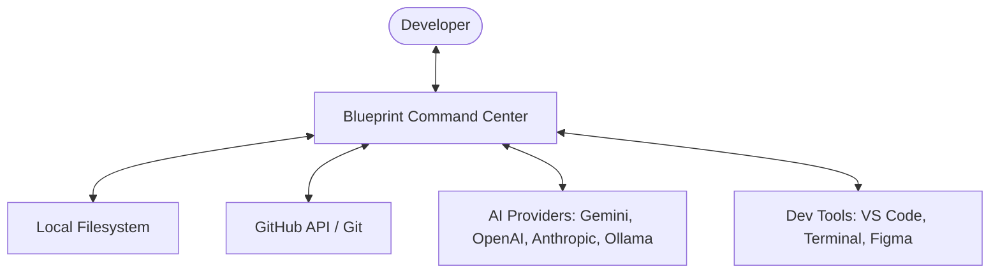
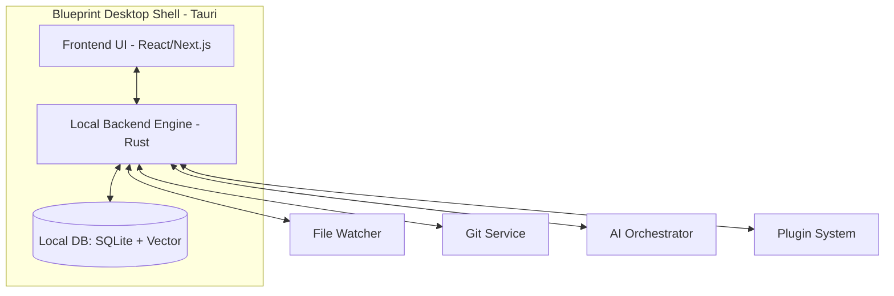
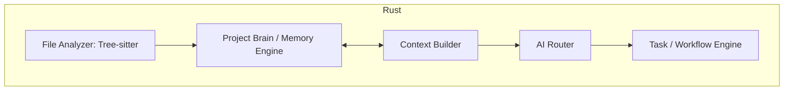

# Blueprint System Architecture Master Plan

## 1. Executive Summary
This document outlines the technical architecture for **Blueprint**, the AI Engineering Command Center. Blueprint is designed as a local-first, high-performance desktop application that serves as the "Intelligence Layer" for software projects. It unifies planning, architecture, and project memory, coordinating various AI providers and development tools into a cohesive engineering workflow.

---

## 2. Architecture Principles
- **Local-First:** All sensitive source code analysis and project indexing happen on the user's machine.
- **Provider Independence:** Pluggable AI backend support (Gemini, OpenAI, Anthropic, Local LLMs).
- **Security by Design:** Minimal attack surface, encrypted secret storage, and strict file-system permissions.
- **Craft & Performance:** Zero-lag UI, efficient indexing of 100k+ files, and low memory footprint.
- **Extensibility:** A robust plugin architecture for language support and tool integrations.

---

## 3. Technology Stack Evaluation

### Selection: **Tauri (Rust + React/Next.js)**

| Technology | Performance | Security | Ecosystem | Verdict |
| :--- | :--- | :--- | :--- | :--- |
| **Electron** | Low (High RAM) | Medium | Excellent | Rejected (Too heavy for a "brain" tool) |
| **Tauri** | **High (Rust)** | **High** | Growing | **Selected** (Security, speed, and local capability) |
| **Flutter** | High | Medium | Medium | Rejected (Ecosystem mismatch for dev tools) |
| **.NET MAUI** | Medium | Medium | Enterprise | Rejected (Not suited for this niche) |

**Rationale:** Tauri provides a secure, Rust-based backend for heavy lifting (indexing, file scanning, git operations) while allowing a modern web-based UI. This aligns perfectly with our "Professional Reliability" principle.

---

## 4. C4 Architecture Diagrams

### Level 1: System Context

### Level 2: Container Diagram

### Level 3: Component Diagram (Core Engine)

---

## 5. Core System Design

### 5.1 Project Brain (The Memory Engine)
The "Project Brain" is a hybrid storage system designed for long-term project memory.
- **Structured Data (SQLite):** Stores architectural decisions, user preferences, project constraints, and metadata.
- **Unstructured Data (Vector DB - local):** Stores embeddings of code snippets, documentation, and conversation history for semantic retrieval.
- **Graph Layer:** Tracks relationships between modules, files, and engineering decisions.

### 5.2 AI Orchestration System
Blueprint does not just "send a prompt." It orchestrates a multi-step intelligence flow:
1. **User Request:** "Implement OAuth2 with Google."
2. **Context Enrichment:** Brain retrieves relevant security constraints and existing auth patterns.
3. **Reference Analysis:** Extracts requirements from linked Figma screenshots or specs.
4. **Prompt Construction:** Combines context, constraints, and project rules into a high-fidelity prompt.
5. **Validation:** Checks AI response against "Project Charter" (e.g., "Does this use unauthorized libraries?").
6. **Proposal:** Presents the user with an Implementation Plan.

---

## 6. GitHub Integration
Blueprint treats GitHub as a first-class source of truth for project evolution.
- **Auth:** OAuth2 via system browser.
- **Sync:** Bi-directional sync of Issues and Pull Requests.
- **Intelligence:** Analyzes PR history to understand "Why" changes were made, feeding the Project Brain.
- **Automation:** Auto-drafts PRs with full "Implementation Context" derived from the planning phase.

---

## 7. File Analysis Engine
To support massive repositories (100k+ files):
- **Incremental Indexing:** Only re-scans changed files via FS events.
- **Tree-sitter:** High-performance, incremental parsing for TS, Python, Go, Rust, etc.
- **Intelligent Ignore:** Deep integration with `.gitignore` and Blueprint-specific exclusion rules.
- **Privacy:** Scans for secrets locally (using regex/entropy) and warns user before any AI interaction.

---

## 8. Plugin Architecture
Blueprint uses a **Sandbox Plugin Model**.
- **Lifecycle:** `onLoad`, `onScan`, `onPlan`, `onReview`.
- **API:** Restricted access to Filesystem and AI Orchestrator via a capability-based security model.
- **Frameworks:** Specific plugins for React, Laravel, Flutter to provide "Framework-Aware" intelligence.

---

## 9. Security & Threat Model

| Threat | Mitigation |
| :--- | :--- |
| **API Key Leakage** | Keytar/System Keychain for secure storage. |
| **Malicious Code Access** | Sandbox execution for plugins; local-first analysis. |
| **Prompt Injection** | Input sanitization and structured output validation. |
| **Cloud Exposure** | User-controlled data redaction before sending to AI providers. |

---

## 10. Performance & Scalability
- **Indexing:** Background worker threads (Rust) ensure UI remains responsive during deep scans.
- **Caching:** Content-addressable storage (CAS) for file hashes to skip redundant analysis.
- **Optimization:** SQLite WAL mode for fast concurrent reads/writes.

---

## 11. Edge Case Handling
- **Workspace Deletion:** Blueprint detects missing root and transitions to "Dormant" state, retaining memory but disabling actions.
- **Provider Downtime:** Automatic fallback to alternative providers (e.g., Gemini -> OpenAI) or Local LLMs (Ollama) for basic tasks.
- **Offline Mode:** Project Brain remains searchable; AI features that require remote LLMs are gracefully disabled.
- **Huge Repo Scan:** Threshold-based indexing. Scans core structure first, then deep-indexes on-demand or in low-priority background threads.

---

## 12. Final Approval Criteria
This architecture is designed to meet the standards of top-tier engineering teams (Stripe, GitHub, Linear):
- **Predictable:** Logic is separated from AI stochasticity.
- **Traceable:** Every decision is logged and attributed.
- **Crafted:** Every millisecond of latency is accounted for.

---
*Blueprint System Architecture — Phase 1 Complete.*
